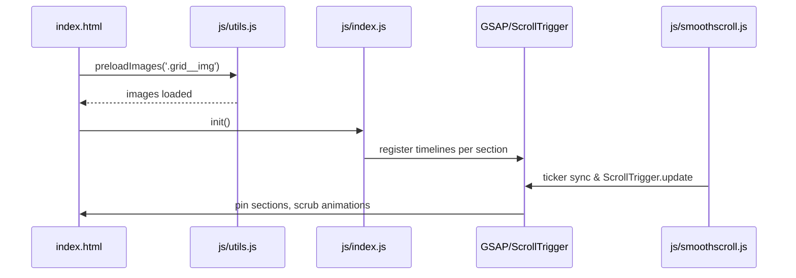
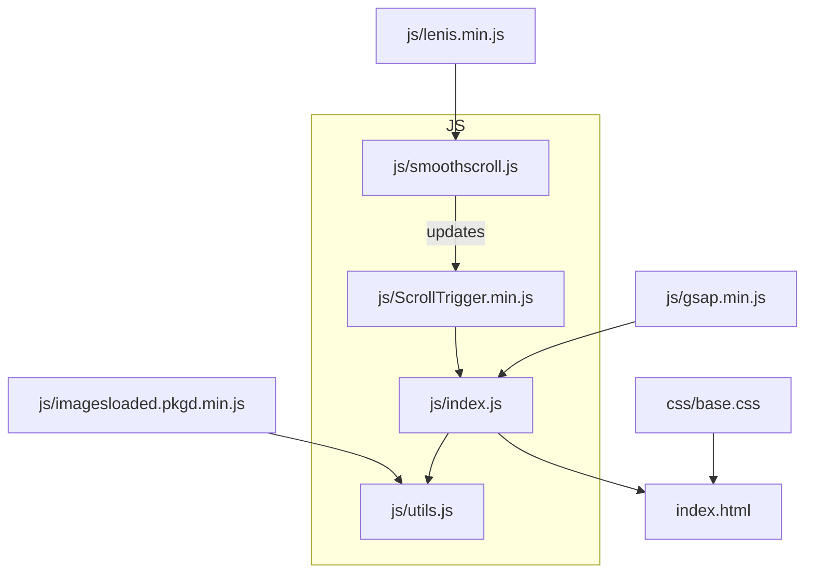

# Component Interaction Diagrams

## Initialization Flow


## Runtime Interaction
```mermaid
flowchart LR
  A[Scroll Input\n(native or Lenis)] --> B[ScrollTrigger]
  B --> C[GSAP Timelines]
  C --> D[DOM Updates\n(.grid__img, .grid__item)]
  D --> E[Visual Output]
```

## Module Relationships


